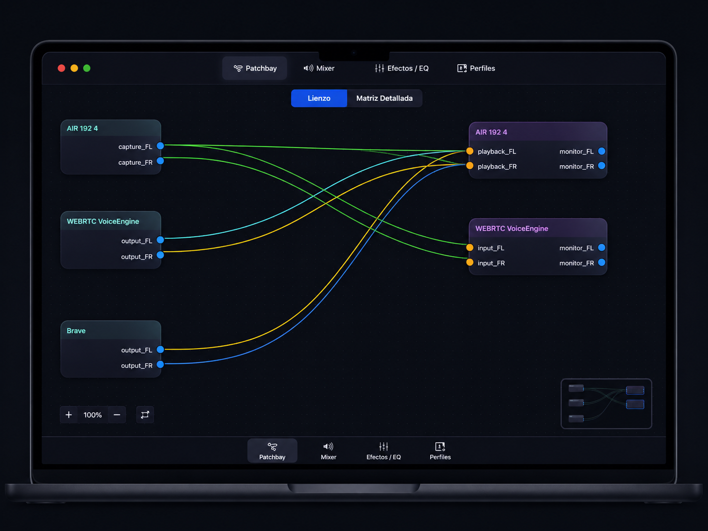

# Audibian



**Audibian** is an open-source desktop audio management application for Linux, built with Rust and GTK 4.  
It provides a visual patchbay, per-application mixer, parametric EQ, noise suppression and persistent audio profiles — all on top of **PipeWire**.

Tested on **Debian 12 (Bookworm)** with PipeWire ≥ 0.3.65.

---

## Features

| Feature | Details |
|---|---|
| 🔌 **Visual Patchbay** | Drag-and-drop canvas to connect and disconnect audio nodes. Nodes are automatically arranged by type (sources → filters → sinks). |
| 🎚️ **Per-app Mixer** | Volume fader and mute toggle for every active audio stream and device. |
| 🎛️ **Parametric EQ** | 5-band parametric equaliser with real-time Cairo curve editor, applied via a PipeWire filter-chain virtual sink. |
| 🎙️ **Noise Suppression** | Per-microphone WebRTC noise suppression. Creates a virtual clean source (`audibian-ns-…`) that any app can select instead of the raw mic. |
| 💾 **Audio Profiles** | Save and restore complete audio states (links, volumes) as TOML files under `~/.config/audibian/profiles/`. |
| ⚡ **Default Profile** | Mark a profile as default; Audibian will apply it automatically 3 seconds after startup, once PipeWire has enumerated all nodes. |
| 🚀 **Autostart** | One toggle creates an XDG autostart entry (`~/.config/autostart/audibian.desktop`) so Audibian launches with your desktop session. |

---

## Requirements

### Runtime

| Dependency | Minimum version | Debian package |
|---|---|---|
| PipeWire | 0.3.52 | `pipewire` |
| PipeWire WebRTC AEC | — | `libspa-0.2-jack` or included in `pipewire-audio` |
| GTK 4 | 4.12 | `libgtk-4-1` |
| libadwaita | 1.5 | `libadwaita-1-0` |

> **Noise suppression** uses `libpipewire-module-echo-cancel` with the WebRTC backend (`libspa-aec-webrtc`), which ships with PipeWire on Debian Bookworm — no extra packages needed.

### Build

| Dependency | Minimum version | Debian package |
|---|---|---|
| Rust + Cargo | 1.75 | [rustup.rs](https://rustup.rs) |
| GTK 4 dev headers | 4.12 | `libgtk-4-dev` |
| libadwaita dev headers | 1.5 | `libadwaita-1-dev` |
| PipeWire dev headers | 0.3 | `libpipewire-0.3-dev` |
| pkg-config | — | `pkg-config` |
| Cairo dev headers | — | `libcairo2-dev` |
| Pango dev headers | — | `libpango1.0-dev` |

Install all build dependencies on Debian:

```bash
sudo apt install \
  libgtk-4-dev libadwaita-1-dev \
  libpipewire-0.3-dev \
  libcairo2-dev libpango1.0-dev \
  pkg-config build-essential
```

---

## Installation

### Build from source

```bash
git clone https://github.com/YOUR_USERNAME/audibian.git
cd audibian
cargo build --release
```

The binary will be at `target/release/audibian`.

### Run directly

```bash
cargo run --release
```

### Install system-wide (optional)

```bash
sudo install -Dm755 target/release/audibian /usr/local/bin/audibian
```

---

## Usage

### Patchbay

- **Drag** from an output port (blue) to an input port (orange) to create a link.
- **Right-click** on a cable to remove the link.
- Nodes are auto-arranged in columns: sources on the left, sinks on the right.

### Mixer

Each detected audio stream gets a vertical fader and a mute button.  
Volume changes are applied immediately via `pactl`.

### Effects / EQ

1. Select a **sink** from the drop-down.
2. Adjust the 5-band EQ (Low Shelf · Peak × 3 · High Shelf).
3. Click **Aplicar EQ** — a virtual sink `audibian-eq-<name>` will appear; route your apps to it.
4. Click **Quitar EQ** to remove the virtual sink.

### Noise Suppression

1. Go to the **Efectos / EQ** tab, scroll to *Supresión de Ruido*.
2. Toggle the switch next to any microphone.
3. A virtual source `audibian-ns-<name>` will appear in the system.
4. In your app (Discord, OBS, etc.) select that virtual source instead of the raw microphone.

### Profiles

1. Set up your desired audio routing in the Patchbay.
2. Give the profile a name and click **Guardar estado actual**.
3. Select a profile and click **Cargar** to restore it.
4. Click **Predeterminado** to mark a profile as the startup profile (toggle to unset).

### Autostart

In the **Perfiles** tab → *Ajustes*, toggle **Iniciar con el sistema** to create or remove the XDG autostart entry for your desktop session.

---

## Configuration files

| Path | Purpose |
|---|---|
| `~/.config/audibian/config.toml` | App settings (default profile, autostart) |
| `~/.config/audibian/profiles/*.toml` | Saved audio profiles |
| `/tmp/audibian-eq-*.conf` | Ephemeral EQ filter-chain configs (cleaned up on start) |
| `/tmp/audibian-ns-*.conf` | Ephemeral NS filter-chain configs (cleaned up on start) |
| `~/.config/autostart/audibian.desktop` | XDG autostart entry (created by the app) |

---

## Architecture

```
src/
├── main.rs                  # Entry point
├── audio/
│   ├── graph.rs             # Audio graph model (nodes, ports, links)
│   ├── pw_thread.rs         # PipeWire monitoring thread (registry listener)
│   ├── eq.rs                # Biquad EQ math (Audio EQ Cookbook)
│   └── effects.rs           # EQ & noise suppression subprocess management
├── profiles/
│   ├── model.rs             # AudioProfile serde model
│   ├── store.rs             # TOML read/write under ~/.config/audibian/profiles/
│   ├── apply.rs             # Profile apply & snapshot logic
│   └── config.rs            # App settings (default profile, autostart)
└── ui/
    ├── app.rs               # Application entry, PW event loop
    ├── window.rs            # Main window, tab switcher
    ├── patchbay/            # Visual canvas (Cairo + GestureDrag)
    ├── mixer/               # Volume strips
    ├── effects/             # EQ curve + noise suppression list
    └── profiles/            # Profile manager + settings
```

**Event flow:** PipeWire registry events arrive on a background thread and are forwarded to the GTK main thread via an `async_channel`. The GTK thread mutates the `AudioGraph` (wrapped in `Rc<RefCell>`) and triggers UI refreshes.

---

## Contributing

Contributions are welcome! Please open an issue before starting large features.

1. Fork the repository
2. Create a feature branch (`git checkout -b feat/my-feature`)
3. Commit your changes
4. Open a Pull Request

### Code style

- Run `cargo clippy` before submitting.
- No panics in production paths — use `Option`/`Result` and log errors.
- UI state lives on the GTK main thread only; never send GTK objects across threads.

---

## License

This project is licensed under the **GNU General Public License v3.0**.  
See [LICENSE](LICENSE) for details.

---

## Acknowledgements

- [Helvum](https://gitlab.freedesktop.org/pipewire/helvum) — inspiration for the patchbay concept.
- [PipeWire](https://pipewire.org/) — the audio/video server powering this app.
- [gtk4-rs](https://gtk-rs.org/) — Rust bindings for GTK 4.
- [libadwaita-rs](https://world.pages.gitlab.gnome.org/Rust/libadwaita-rs/) — GNOME HIG widgets for Rust.
